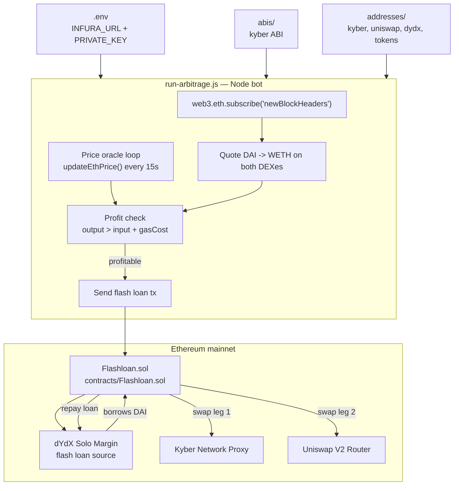

<h1 align="center">profitable-flashloans</h1>

<p align="center">
  <strong>WATCH BLOCKS. SPOT ARBITRAGE. BORROW. PROFIT.</strong>
</p>

<p align="center">
  
  <a href="LICENSE"></a>
  
  
  
</p>

**profitable-flashloans** is a _DeFi arbitrage bot_ that listens to new Ethereum blocks, compares DAI/WETH prices across Kyber and Uniswap, and fires a **dYdX flash loan** the moment a spread covers gas. No capital required — the loan is borrowed, swapped, and repaid inside a single atomic transaction.

If the trade is not profitable end-to-end, the transaction reverts and you lose nothing but gas estimation cycles.

<p align="center">
  <a href="#quick-start">Getting Started</a> ·
  <a href="#how-it-works">How It Works</a> ·
  <a href="#configuration">Configuration</a> ·
  <a href="#project-layout">Layout</a> ·
  <a href="#disclaimer">Disclaimer</a>
</p>

## Quick Start

Runtime: **Node 16** (pinned in `package.json#engines`).
Toolchain: **[Truffle](https://trufflesuite.com/)** for contract compilation and migration.

```bash
git clone https://github.com/DeanShaked/profitable-flashloans.git
cd profitable-flashloans
npm install
npm start
```

The bot connects over a WebSocket provider, subscribes to `newBlockHeaders`, and prints arbitrage checks on every new block.

### Prerequisites

- **[Node.js 16](https://nodejs.org)** — required (web3 + truffle pinning)
- **[Truffle](https://trufflesuite.com/)** — for compiling and deploying `contracts/Flashloan.sol`
- **Ethereum WebSocket endpoint** — [Infura](https://infura.io), [Alchemy](https://alchemy.com), or your own node
- **Funded mainnet account** — to pay gas on flash loan executions
- Public node providers are slow and front-runnable. For real use, run your own node.

### Environment Setup

Create a `.env` file at the project root:

```bash
INFURA_URL=wss://mainnet.infura.io/ws/v3/YOUR_PROJECT_ID
PRIVATE_KEY=0xyour_private_key_here
```

Then compile and migrate the flash loan contract:

```bash
truffle compile
truffle migrate --network mainnet
```

## How It Works



On every new block the bot:

1. Fetches DAI→WETH and WETH→DAI quotes from **Kyber** and **Uniswap** for a fixed `AMOUNT_DAI_WEI` (20,000 DAI by default).
2. Estimates gas cost in DAI using the live ETH price.
3. If `output - input - gasCost > 0` for either direction, calls `Flashloan.initiateFlashloan(...)` with the trade direction (`KYBER_TO_UNISWAP` or `UNISWAP_TO_KYBER`).
4. The contract borrows DAI from **dYdX Solo**, executes both swap legs, repays the loan, and keeps the spread — atomically in a single transaction.

If any leg fails or profit evaporates between estimation and execution, the entire transaction reverts.

## Configuration

The arbitrage parameters are set as constants near the top of [`run-arbitrage.js`](run-arbitrage.js).

| Constant         | Default         | Purpose                                                      |
| ---------------- | --------------- | ------------------------------------------------------------ |
| `AMOUNT_DAI_WEI` | `20000` DAI     | Notional size of the flash loan, in wei                      |
| `ONE_WEI`        | `1` ETH (wei)   | Scaling unit for `BN` math                                   |
| `DIRECTION`      | enum            | `KYBER_TO_UNISWAP = 0`, `UNISWAP_TO_KYBER = 1`               |
| Polling          | every 15s       | `updateEthPrice()` interval, used to value gas in DAI        |

Token and exchange addresses live in [`addresses/`](addresses/) and ABIs in [`abis/`](abis/).

## Project Layout

```
.
├── contracts/
│   ├── Flashloan.sol           # dYdX-callback contract executing the arb
│   ├── IUniswapV2Router01.sol  # Uniswap router interface
│   ├── IUniswapV2Router02.sol  # Uniswap router interface
│   ├── IWeth.sol               # WETH wrap/unwrap interface
│   └── Migrations.sol          # Truffle bookkeeping
├── migrations/
│   ├── 1_initial_migration.js
│   └── 2_deploy_contracts.js
├── addresses/                  # Mainnet contract addresses (kyber, uniswap, dydx, tokens)
├── abis/                       # On-chain ABIs (kyber)
├── test/                       # Truffle test suite
├── run-arbitrage.js            # The bot — block subscription + decision loop
├── truffle-config.js           # Network + compiler config
├── Procfile                    # Process definition (e.g. for Heroku-style runners)
└── package.json
```

## Scripts

| Command              | Description                                        |
| -------------------- | -------------------------------------------------- |
| `npm start`          | Run the arbitrage bot (`node run-arbitrage.js`)    |
| `truffle compile`    | Compile Solidity contracts                         |
| `truffle migrate`    | Deploy `Flashloan.sol` to the configured network   |
| `truffle test`       | Run the contract test suite                        |

## Arbitrage Specs

- **Decentralized exchanges:** Uniswap V2, Kyber Network
- **Flash loan source:** dYdX Solo Margin
- **Tokens:** DAI, WETH
- **Network:** Ethereum mainnet

More tokens, DEXes, and L2 networks are on the roadmap.

## Disclaimer

<details open>
<summary><strong>Read this before running on mainnet</strong></summary>

This project is **experimental software** and was originally written as a learning exercise. Running it on mainnet means:

- You are sending real transactions with a real private key on a real chain.
- Public RPC endpoints are slow and **front-runnable** — competing MEV bots with co-located nodes will beat you to most opportunities.
- Pricing data on the Ethereum mainnet has been heavily arbitraged; profitable spreads on DAI/WETH between Kyber and Uniswap are rare and brief.
- Failed transactions still cost gas.
- The dependency stack (`web3@1`, `@uniswap/sdk@2`, `@studydefi/money-legos`, Node 16) is **outdated** and may have unpatched issues.

Use at your own risk. Audit the contract before deploying. Test on a fork (e.g. Anvil, Hardhat mainnet fork) before sending real funds.

</details>

## Project Docs

<table>
  <tr>
    <td align="center"><a href="#tab-license"><strong>License</strong></a></td>
    <td align="center"><a href="#tab-contributing"><strong>Contributing</strong></a></td>
    <td align="center"><a href="#tab-references"><strong>References</strong></a></td>
  </tr>
</table>

<a id="tab-license"></a>

<details open>
<summary><strong>License</strong></summary>

Released under the **ISC License**. Free to use, modify, and distribute. Provided "as is" with no warranty.

</details>

<a id="tab-contributing"></a>

<details>
<summary><strong>Contributing</strong></summary>

Issues and pull requests are welcome.

- Fork the repo and open a PR against `main`.
- Keep changes focused — separate refactors from feature work.
- If you add a new DEX or token pair, include the addresses and ABIs and update the `Arbitrage Specs` section.

</details>

<a id="tab-references"></a>

<details>
<summary><strong>References</strong></summary>

- [dYdX Solo flash loans](https://docs.dydx.exchange/) — zero-fee atomic borrowing
- [Uniswap V2 SDK](https://docs.uniswap.org/sdk/v2/overview) — pair pricing and quotes
- [Kyber Network Proxy](https://docs.kyberswap.com/) — on-chain liquidity router
- [@studydefi/money-legos](https://github.com/studydefi/money-legos) — bundled DeFi interfaces and addresses

</details>
